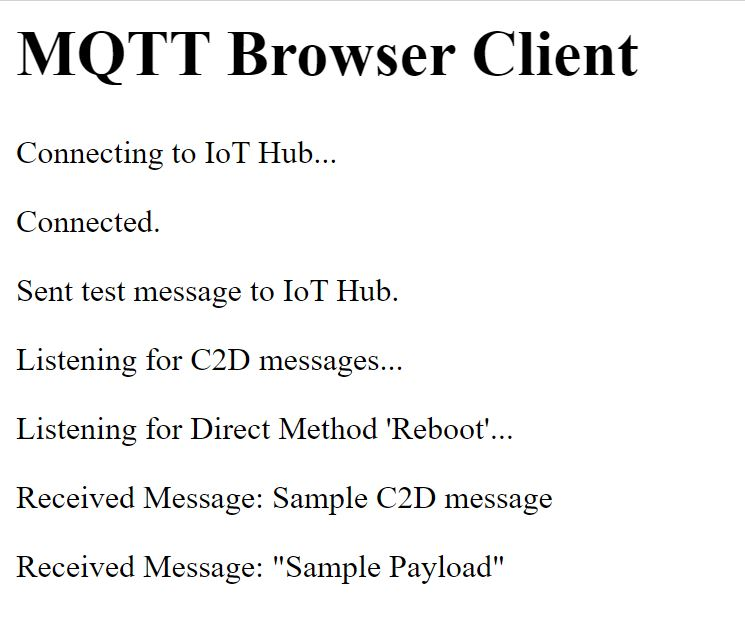

# MQTT Browser Client

A JavaScript app that connects to IoT Hub from a web browser. Supports sending messages to IoT Hub, C2D messages and Direct Methods. Uses the [Eclipse Paho JS lib](https://github.com/eclipse/paho.mqtt.javascript) to send MQTT over WebSockets. Browser must support WebSockets.

## Instructions

1. Using [Azure IoT Explorer](https://github.com/Azure/azure-iot-explorer#:~:text=Azure%20IoT%20Explorer%20%28preview%29%201%20Table%20of%20Contents,anytime%20by%20returning%20to%20Home.%20More%20items...%20), create a device in your IoT Hub.
1. Paste the Device ID into ```clientid```.
1. In Azure IoT Explorer select your device and generate a **Connection string with SAS Token**.
1. Copy the part of the connection string beginning at ```SharedAccessSignature sr=...``` and paste this into ```pwd```.
1. Paste your IoT Hub FDQN (e.g. ```your_iot_hub_name.azure-devices.net```) into ```host```.

